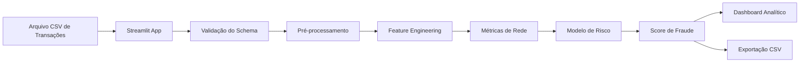
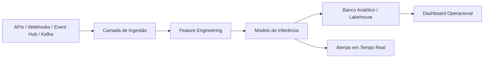

# FraudNet AI — Detecção Inteligente de Fraudes com Machine Learning e Análise de Redes

> Plataforma analítica para identificar transações suspeitas em ambientes bancários, fintechs, marketing financeiro e serviços digitais, combinando **Machine Learning**, **Big Data Analytics**, **análise de redes** e uma interface web em **Streamlit**.
> Link de Apresentação: https://www.youtube.com/watch?v=kdQ1cjrpO5Q

---

## Visão Geral

O **FraudNet AI** é um projeto de Ciência de Dados aplicado ao contexto de **serviços financeiros**, criado para demonstrar como técnicas de regressão, classificação, análise de redes e Machine Learning podem ser usadas para apoiar a detecção de fraudes em transações.

A solução permite que o usuário envie uma base `.csv` de transações, processe os dados, gere variáveis analíticas, aplique um modelo de risco e visualize os resultados em um dashboard interativo.

O objetivo é transformar dados transacionais em uma visão operacional de risco, respondendo perguntas como:

- Quais transações possuem maior probabilidade de fraude?
- Quais usuários, cartões, dispositivos ou IPs apresentam comportamento suspeito?
- Qual é a distribuição de risco da base analisada?
- Quais transações devem ser priorizadas para revisão manual?
- Como métricas de rede podem enriquecer modelos tradicionais de classificação?

---

## Problema de Negócio

Bancos, fintechs, empresas de cartão, marketplaces e plataformas digitais processam grandes volumes de transações diariamente. Dentro desse volume, fraudes podem ocorrer de forma rápida, distribuída e difícil de identificar manualmente.

Alguns desafios comuns são:

- alto volume de transações;
- padrões de fraude cada vez mais dinâmicos;
- múltiplos dispositivos e contas conectados entre si;
- necessidade de resposta rápida;
- custo operacional de revisão manual;
- risco de bloquear clientes legítimos;
- dificuldade em transformar dados brutos em decisões acionáveis.

O **FraudNet AI** propõe uma abordagem analítica que combina dados transacionais com métricas de relacionamento entre entidades, como usuários, dispositivos, cartões e IPs.

---

## Proposta de Solução

O produto funciona como uma camada analítica antifraude.

O fluxo principal é:

```text
Upload CSV
   ↓
Validação das colunas
   ↓
Pré-processamento dos dados
   ↓
Criação de variáveis comportamentais
   ↓
Criação de métricas de rede
   ↓
Aplicação do modelo de risco
   ↓
Classificação das transações
   ↓
Dashboard + exportação dos resultados
```

A solução entrega uma base enriquecida com:

- `fraud_score`: pontuação de risco da transação;
- `risk_level`: classificação de risco em Baixo, Médio ou Alto;
- métricas de rede por usuário, dispositivo, cartão e IP;
- visão consolidada para tomada de decisão.

---

## Público-Alvo

Este projeto foi pensado para contextos como:

- bancos digitais;
- fintechs;
- seguradoras;
- adquirentes;
- empresas de cartão;
- marketplaces;
- áreas de prevenção a fraudes;
- times de risco;
- times de dados em serviços financeiros;
- áreas de CRM, marketing financeiro e inteligência comercial.

---

## Diferenciais do Projeto

Este projeto se diferencia por unir três camadas importantes:

### 1. Machine Learning Aplicado

Modelos supervisionados podem ser utilizados para estimar a probabilidade de fraude a partir de variáveis transacionais e comportamentais.

Exemplos de técnicas relacionadas:

- Regressão Logística;
- Regressão Linear como base conceitual;
- Regressões Lasso e Ridge;
- Árvores de Decisão;
- SVM;
- Redes Neurais;
- validação e teste de modelos.

### 2. Análise de Redes

Além de analisar a transação isolada, o projeto considera relações entre entidades:

```text
Usuário ↔ Dispositivo ↔ Cartão ↔ IP ↔ Transação
```

Com isso, é possível analisar:

- distribuição de graus;
- centralidade;
- conexões incomuns;
- padrões de rede;
- agrupamentos suspeitos;
- comportamento coletivo.

### 3. Produto Demonstrável

A solução foi transformada em um aplicativo web com **Streamlit**, permitindo uma experiência mais próxima de um produto real.

---

## Arquitetura da Solução



---

## Arquitetura Futura

A aplicação foi construída pensando em evolução para cenários mais robustos.



Possíveis evoluções:

- conexão com APIs bancárias;
- ingestão em tempo real;
- mensageria com Kafka ou Azure Event Hub;
- persistência em banco relacional ou lakehouse;
- monitoramento de drift;
- MLOps;
- integração com Power BI;
- criação de endpoint REST para inferência online.

---

## Tecnologias Utilizadas

| Categoria | Tecnologias |
|---|---|
| Linguagem | Python |
| Aplicação Web | Streamlit |
| Manipulação de Dados | Polars, Pandas |
| Machine Learning | Scikit-learn |
| Serialização de Modelo | Joblib |
| Visualização | Streamlit Charts |
| Dados | CSV sintético |
| Ambiente | Execução local em Windows/Linux/macOS |

---

## Conceitos de Ciência de Dados Aplicados

Este projeto foi desenhado para se conectar a conceitos importantes de Ciência de Dados e Machine Learning:

- Regressão Linear;
- Regressão Logística;
- Regressões Lasso e Ridge;
- Árvores de Regressão e Classificação;
- Treinamento, Validação e Teste;
- Testes de Hipóteses;
- Máquina de Vetores de Suporte;
- Big Data Analytics;
- Redes Neurais Artificiais;
- Perceptron;
- TLU;
- Adaline;
- Gradiente Descendente;
- Multi-layer Perceptron;
- Cross-Entropy;
- Funções Não Convexas;
- Análise de Redes;
- Distribuição de Graus;
- Lei de Potência;
- Centralidade;
- Modelos de Redes;
- Redes Reais.

---

## Estrutura do Projeto

```text
fraudnet_streamlit_local/
│
├── app.py
├── fraud_engine.py
├── generate_sample_data.py
├── generate_large_sample.py
├── train_demo_model.py
├── requirements.txt
├── run_app.bat
├── run_app_existing_env.bat
├── README.md
│
├── .streamlit/
│   └── config.toml
│
├── models/
│   └── fraudnet_demo_model.joblib
│
├── data/
│   └── exemplo_transacoes.csv
│
├── outputs/
│
└── docs/
    └── documentacao_tecnica.md
```

---

## Base de Dados

A base utilizada no projeto é **100% sintética** e foi criada apenas para demonstração técnica.

Ela simula transações financeiras com campos como:

| Coluna | Descrição |
|---|---|
| `transaction_id` | Identificador único da transação |
| `user_id` | Identificador do usuário |
| `device_id` | Identificador do dispositivo |
| `card_id` | Identificador do cartão |
| `ip_id` | Identificador do IP |
| `amount` | Valor da transação |
| `hour` | Hora da transação |
| `country` | País da transação |
| `channel` | Canal da transação |
| `is_fraud` | Rótulo sintético indicando fraude |

Exemplo:

```csv
transaction_id,user_id,device_id,card_id,ip_id,amount,hour,country,channel,is_fraud
txn_0000000001,u001234,d005678,c009876,ip004321,245.90,22,BR,app,0
txn_0000000002,u002345,d006789,c001234,ip005432,2190.75,3,US,api,1
```

---

## Como Executar Localmente

### 1. Clonar o repositório

```bash
git clone https://github.com/seu-usuario/fraudnet-ai.git
cd fraudnet-ai
```

### 2. Criar ambiente virtual

```bash
python -m venv .venv
```

### 3. Ativar ambiente virtual

No Windows:

```bash
.venv\Scripts\activate
```

No Linux/macOS:

```bash
source .venv/bin/activate
```

### 4. Instalar dependências

```bash
pip install -r requirements.txt
```

### 5. Executar a aplicação

```bash
streamlit run app.py
```

---

## Execução Rápida no Windows

Caso esteja no Windows, também é possível executar usando o arquivo:

```text
run_app.bat
```

Esse arquivo automatiza a criação do ambiente, instalação das dependências e abertura da aplicação.

---

## Como Usar o App

### Opção 1 — Upload Manual

1. Abra o app no navegador.
2. Envie um arquivo `.csv`.
3. Aguarde a validação.
4. Execute a análise.
5. Visualize os resultados.
6. Baixe a base classificada.

### Opção 2 — Caminho Local

Para arquivos muito grandes, recomenda-se usar o caminho local do arquivo em vez do upload pelo navegador.

Exemplo:

```text
C:\Projetos\fraudnet-ai\data\fraudnet_transacoes_2M.csv
```

Essa opção é mais indicada para bases com milhões de linhas.

---

## Exemplo de Base com 2 Milhões de Linhas

Foi criada uma base sintética com:

```text
Linhas: 2.000.000
Colunas: 10
Tamanho aproximado: 125 MB
Taxa sintética de fraude: aproximadamente 10,9%
```

Essa base permite testar o comportamento da aplicação em um cenário mais próximo de Big Data Analytics, considerando limitações de execução local.

---

## Geração de Dados Sintéticos

Para gerar uma base pequena:

```bash
python generate_sample_data.py
```

Para gerar uma base maior:

```bash
python generate_large_sample.py --rows 1000000 --chunk-size 100000 --output data/transacoes_1M.csv
```

Exemplo com 2 milhões de linhas:

```bash
python generate_large_sample.py --rows 2000000 --chunk-size 100000 --output data/transacoes_2M.csv
```

---

## Treinamento do Modelo

Caso queira treinar novamente o modelo de demonstração:

```bash
python train_demo_model.py
```

O treinamento utiliza a coluna `is_fraud` como variável-alvo.

O modelo treinado é salvo em:

```text
models/fraudnet_demo_model.joblib
```

---

## Saída Esperada

Após a execução da análise, o app gera uma base com campos como:

| Campo | Descrição |
|---|---|
| `fraud_score` | Pontuação de risco da transação |
| `risk_level` | Classificação do risco |
| `user_degree` | Quantidade de transações associadas ao usuário |
| `device_degree` | Quantidade de transações associadas ao dispositivo |
| `card_degree` | Quantidade de transações associadas ao cartão |
| `ip_degree` | Quantidade de transações associadas ao IP |

Exemplo de classificação:

```text
fraud_score >= 0.75 → Alto
fraud_score >= 0.45 → Médio
fraud_score < 0.45  → Baixo
```

---

## Aplicações em Negócios

### Bancos e Fintechs

- análise de transações suspeitas;
- priorização de revisão manual;
- monitoramento de contas e dispositivos;
- identificação de padrões incomuns;
- redução de perdas financeiras.

### Marketing Financeiro

- segmentação de clientes com base em risco;
- criação de jornadas diferenciadas para clientes confiáveis;
- redução de atrito em transações legítimas;
- análise de comportamento digital.

### Serviços Financeiros

- análise de risco operacional;
- scoring de transações;
- monitoramento de canais digitais;
- apoio a times de compliance e prevenção.

---

## Possíveis Indicadores do Dashboard

O dashboard pode apresentar:

- total de transações analisadas;
- quantidade de transações de alto risco;
- percentual de risco por canal;
- distribuição de score;
- ranking de usuários, IPs ou dispositivos suspeitos;
- volume por país;
- comparação entre risco baixo, médio e alto;
- tabela final para investigação operacional.

---

## Estratégia Analítica

A estratégia do projeto segue três etapas:

### 1. Análise Descritiva

Entender a distribuição dos dados:

- valores de transação;
- horários;
- canais;
- países;
- usuários mais recorrentes.

### 2. Análise Preditiva

Aplicar modelos capazes de estimar a probabilidade de fraude:

- Regressão Logística;
- modelos regularizados;
- árvores;
- SVM;
- redes neurais em evolução futura.

### 3. Análise de Redes

Enriquecer o modelo com relações entre entidades:

- usuários conectados a muitos dispositivos;
- cartões usados em muitos IPs;
- IPs associados a várias contas;
- dispositivos compartilhados por muitos usuários.

---

## Roadmap

| Fase | Evolução |
|---|---|
| v1 | Upload CSV e análise batch |
| v2 | Treinamento customizado pelo usuário |
| v3 | Conexão com banco de dados |
| v4 | API REST para inferência |
| v5 | Monitoramento em tempo real |
| v6 | Integração com lakehouse |
| v7 | Dashboard executivo em Power BI |
| v8 | Monitoramento de drift e performance do modelo |
| v9 | MLOps com versionamento de modelo |
| v10 | Explicabilidade com SHAP/LIME |

---

## Cuidados e Limitações

Este projeto é uma demonstração acadêmica e de portfólio.

Pontos importantes:

- os dados são sintéticos;
- o modelo não deve ser usado diretamente em produção;
- um sistema antifraude real exigiria validação estatística robusta;
- seria necessário monitoramento contínuo;
- decisões automatizadas devem considerar explicabilidade, governança e revisão humana;
- o uso em produção exigiria conformidade com políticas de privacidade e segurança.

---

## Por que este projeto é relevante para recrutadores?

Este projeto demonstra competências importantes para posições de **Analista de Dados**, **Cientista de Dados**, **Analista de BI**, **Analytics Engineer** e **profissionais de dados em serviços financeiros**:

- entendimento de problema de negócio;
- construção de produto analítico;
- manipulação de dados em Python;
- criação de pipeline de features;
- aplicação de Machine Learning;
- raciocínio estatístico;
- visão de Big Data;
- análise de redes;
- construção de aplicação web;
- storytelling para tomada de decisão;
- preocupação com escalabilidade e evolução arquitetural.

---

## Demonstração Conceitual do Produto

```text
Transação recebida
      ↓
FraudNet AI calcula variáveis
      ↓
Modelo estima probabilidade de fraude
      ↓
Sistema classifica risco
      ↓
Time antifraude prioriza análise
```

---

## Exemplo de Decisão Operacional

| Score | Risco | Ação Recomendada |
|---|---|---|
| 0.00 a 0.44 | Baixo | Aprovar automaticamente |
| 0.45 a 0.74 | Médio | Enviar para validação adicional |
| 0.75 a 1.00 | Alto | Bloquear temporariamente ou revisar manualmente |

---

## Autor

Desenvolvido por **Kennedy Anderson** como projeto de portfólio em Ciência de Dados, Machine Learning e Analytics aplicado ao setor financeiro.

- LinkedIn: `adicione seu link`
- GitHub: `adicione seu link`
- Portfólio: `adicione seu link`

---

## Licença

Este projeto está disponível para fins educacionais e demonstração de portfólio.


---

## Aviso

O FraudNet AI é uma solução demonstrativa. Nenhum dado real de cliente, banco, cartão, transação financeira ou instituição foi utilizado neste projeto.
